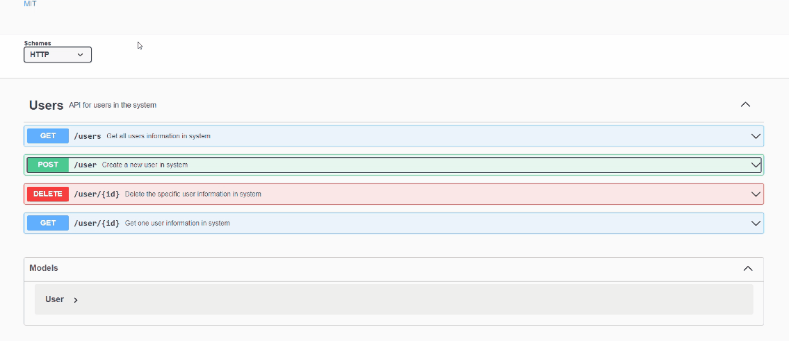

# Easy-User-API-Creater


## Description:
  > This is my first swagger application.
  > This program is to create user jason data quickly through swagger.

## Installation:
  1. Downloads each file into one file. <br>
    1. **index.js** <br>
     2. **swagger.json**<br>
     3. **package.json**<br>
  3. Open shell and type **npm init**.
     ```console
     npm init
     ```
  4. Type **npm install**.
     ```console
     npm install
     ```
  5. type **npm start** to start the server.
     ```console
     npm start
     ```
  6. Go online and type **[http://localhost:3000/api-docs](http://localhost:3000/api-docs)** in URL box.

  
## Usage:
  This program to create the user information API json data. To create one user information, it requires user's id, first name, last name, phone number, email address, password, and gender.

  **Schema exmale:** 
  ```console
  {
  "id": 0,
  "first": "string",
  "last": "string",
  "phone": 0,
  "email": "string",
  "password": "string",
  "gender": "male"
  }
  ```
  ### How to use GET:/users
  
  
  
  ### How to use Post:/user
  
  
  
  ### How to use Delete:/user{id}
  
  
  
  ### How to use Get:/user
  
  
  
## Support:
  If any question, message me via **[my twitter](https://twitter.com/Kojiro38895598)**.
  
## Roadmap:
  I will ausolutely add update functionality. Possibly, I will add or delete some properties for schema. 


  ***For reference:***<br>
  > **[Swaggr Editter](https://editor.swagger.io/)**<br>
  > **[Swagger UI Express](https://www.npmjs.com/package/swagger-ui-express)**
  
## License information: 
Copyright 2022 Kojiro Asano

Permission is hereby granted, free of charge, to any person obtaining a copy of this software and associated documentation files (the "Software"), to deal in the Software without restriction, including without limitation the rights to use, copy, modify, merge, publish, distribute, sublicense, and/or sell copies of the Software, and to permit persons to whom the Software is furnished to do so, subject to the following conditions:

The above copyright notice and this permission notice shall be included in all copies or substantial portions of the Software.

THE SOFTWARE IS PROVIDED "AS IS", WITHOUT WARRANTY OF ANY KIND, EXPRESS OR IMPLIED, INCLUDING BUT NOT LIMITED TO THE WARRANTIES OF MERCHANTABILITY, FITNESS FOR A PARTICULAR PURPOSE AND NONINFRINGEMENT. IN NO EVENT SHALL THE AUTHORS OR COPYRIGHT HOLDERS BE LIABLE FOR ANY CLAIM, DAMAGES OR OTHER LIABILITY, WHETHER IN AN ACTION OF CONTRACT, TORT OR OTHERWISE, ARISING FROM, OUT OF OR IN CONNECTION WITH THE SOFTWARE OR THE USE OR OTHER DEALINGS IN THE SOFTWARE.
